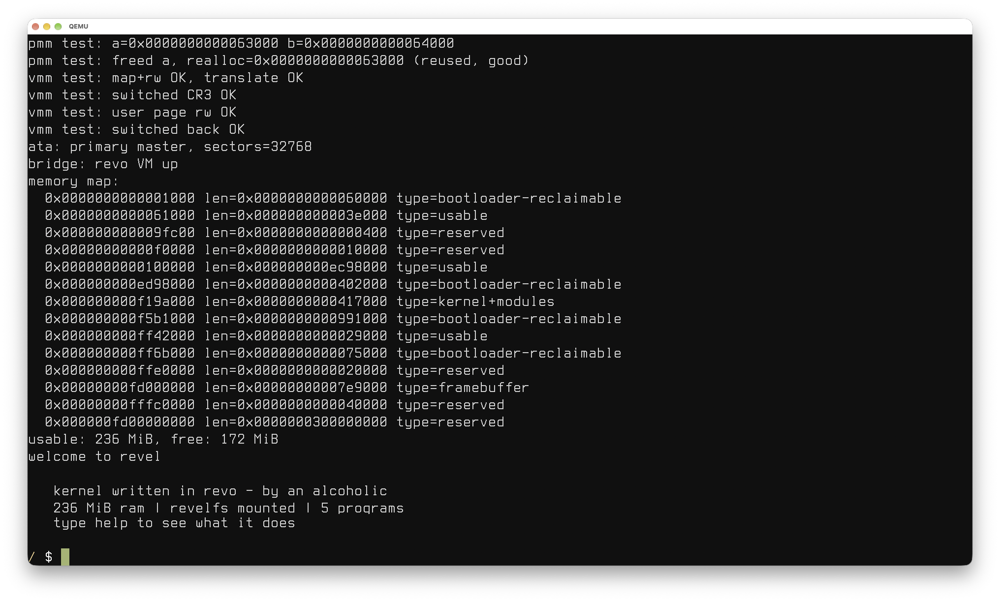

# `revel
`/ˈrɛvəl/` a small x86-64 unix like os written in [revo](https://github.com/if-not-nil/revo). *(ty [gingeh](https://tech.lgbt/@Gingeh) for the ipa)*



## quickstart
you need :

- zig 0.17.0 (exact)
- qemu (`qemu-system-x86_64`)
- xorriso (limine builds the iso with it)
- the `revo` and `limine` submodules

```
make run      # build kernel and boot in qemu
make iso      # just build revel.iso
make wipedisk # drop the disk
make clean    # drop build output
```

## architecture
there is a lot of things the revo vm cannot do on it's own because there is a minimum floor that it needs to have things setup like interrupts and a heap. limine hands over long mode with a framebuffer and a memory map and zig sets up the machine (gdt + tss, idt, frame allocator, heap, ata, framebuffer) and starts the revo vm, after that most the operations are done in revo via. the aid of a couple low level helpers for the stuff a bytecode vm can't touch, page tables, ring switches, disk dma, saving registers on an interrupt.

### memory
limine already maps every physical page into the higher half (hhdm) so physical address `p` is just `p + hhdm_offset` and the kernel never has to map a page before it can read it. physical allocation is a frame bitmap, one bit per 4 kib page so it scans next fit from wherever the last alloc landed. there's a second pass that walks the bitmap for a contiguous run which is how the heap gets one flat buffer.

> [!NOTE]
> frame 0 is never handed out.

paging is just ordinary 4 level tables (pml4 > pdpt > pd > pt), present/write/user bits on every entry, a new address space copies the kernel's top half of the pml4 (entries 256..511) into a fresh table so the kernel is mapped in every process and a `cr3` switch costs nothing to survive. the bottom half is the process.

> [!NOTE]
> `cr3` and `invlpg` are the only ones implemented asm.

the heap is 64 mib pulled off the pmm at boot and a next fit free list with 16 byte headers that coalesces lazily and the vm allocates out of it. that's kinda it.

### interrupts
the gdt is the usual segments plus a tss, it holds `rsp0` which gets swapped on every task switch along with the ist stacks. `int 0x80` runs on ist1 on purpose because a syscall can call back into the revo interpreter and the interpreter's computed goto burns way more stack than the 16 kib per task kstack has, and `#df` and `#pf` get ist2 so a kernel stack overflow faults cleanly instead of triple faulting into a reboot.

exceptions (0..31) all dump their frame and `cr2` to serial and halt, admitedly this isnt a safe architecture but it's the way it is for sake of simplicity tbh. irqs are the path that actually returns so the 8259 is remapped to vectors 0x20..0x27 and irq0 is the pit while irq1 is the keyboard. 

### scheduling and ring 3
the scheduler is just a round robin over 8 tasks w/ 16 kib of kernel stack each. task 0 is the kernel itself (the vm and shell, ring 0) and everything else is a user program. spawning one builds it a ready made interrupt frame :

```
cs=0x1b | ss=23x23 : drop it to ring 3
rflags=0x202       : keep interrupts on

rip -> elf entry
rsp -> user stack
rdi -> argc
rsi -> argv
```

a context switch is barely anything because the timer irq already did the expensive part. entering the handler pushed the running task's registers onto the kernel stack as a frame so the scheduler just copies the next task's saved frame over it and swaps `cr3` and `rsp0`; the `iretq` that ends the handler restores into that task instead.

> [!NOTE]
> a task that has never run still has a frame, the one spawn built for it, so its first `iretq` is also how it enters ring 3.

### filesystem
revelfs is just FAT with the serial numbers filed off, a superblock, a block chain and 32 byte directory entries, `/proc` is a vfs managed at runtime.

## syscalls
the syscall table

| rax | name       | rdi  | rsi    | rdx    | rcx    | returns                   |
|-----|------------|------|--------|--------|--------|---------------------------|
| 0   | `exit`     | code |        |        |        | (does not return)         |
| 1   | `write`    | fd   | buffer | length |        | bytes written             |
| 2   | `read`     | fd   | buffer | length |        | bytes read (0 = eof/none) |
| 4   | `fs_size`  | name |        |        |        | file size or -1           |
| 5   | `fs_read`  | name | offset | buffer | length | bytes read                |
| 6   | `fs_write` | name | buffer | length |        | result                    |
| 7   | `open`     | path | flags  |        |        | fd or -1                  |
| 8   | `close`    | fd   |        |        |        | 0 or -1                   |
| 9   | `lseek`    | fd   | offset | whence |        | new offset                |
| 10  | `brk`      | addr |        |        |        | new break or -1           |
| 11  | `sbrk`     | inc  |        |        |        | old break or -1           |

the three preopened fds

| fd | role             |
|----|------------------|
| 0  | keyboard (stdin) |
| 1  | console (stdout) |
| 2  | console (stderr) |

a `read` on the keyboard blocks when nothing is buffered, it rewinds `rip` back onto the `int 0x80` and parks the task until a keypress wakes it then the syscall just runs again.

`open` returns the next free fd. its flags and `lseek`'s whence are the linux values.

| `open` flag | value | `lseek` whence | value |
|-------------|-------|----------------|-------|
| `O_WRONLY`  | 1     | `SEEK_SET`     | 0     |
| `O_CREAT`   | 0x40  | `SEEK_CUR`     | 1     |
| `O_TRUNC`   | 0x200 | `SEEK_END`     | 2     |
| `O_APPEND`  | 0x400 |                |       |

## contributing
contributing is both welcome and encouraged, via prs, issues, or suggestions. or just [join the revo discord](https://discord.com/invite/XzGWh7TX59).

if you're adding a feature or fixing a bug, test that it actually works.

> [!TIP]
> for a headless run add `-display none -serial file:serial.log` and `-qmp unix:...` then read the log or drive it over qmp.

> [!NOTE]
> `.rv` parse errors show up at boot on `serial0`, since every kernel module is parsed into one program.

## license
mit, see [license](LICENSE).
